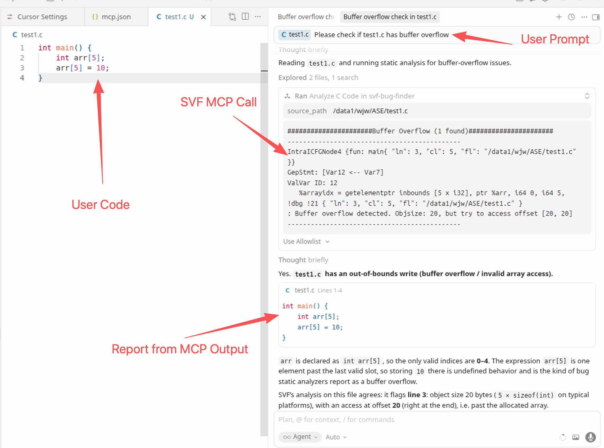

# SVF-MCP

MCP Server that exposes [SVF](https://github.com/SVF-tools/SVF) (Static Value-Flow Analysis) as a tool for Cursor AI. It can detect buffer overflows and memory safety bugs in C/C++ source code directly from the Cursor chat.



## How It Works

```
User: "check test1.c for buffer overflows"
          │
          ▼
    Cursor AI Agent
          │  (calls analyze_c_code tool via MCP)
          ▼
    ┌─────────────────────┐
    │   SVF-MCP Server    │
    │                     │
    │  1. clang → .ll     │  (compile C to LLVM IR)
    │  2. opt mem2reg     │  (optimize IR)
    │  3. pysvf analysis  │  (SVF abstract execution)
    │  4. return report   │
    └─────────────────────┘
          │
          ▼
    "Buffer overflow detected at line 5:
     Objsize: 20, but try to access offset [20, 20]"
```

## Prerequisites

This server depends on components already present on the machine:

| Dependency | Path |
|---|---|
| Python 3.10 | `/usr/bin/python3.10` |
| pysvf | `pip install` (already installed in user site-packages) |
| LLVM 18.1.0 (clang, opt) | `/data1/wjw/SVF-projects/propagate/SVF/llvm-18.1.0.obj/bin/` |
| SVF analysis code | `/data1/wjw/SVF-projects/Software-Security-Analysis/Assignment-3/Python/` |

## Install

```bash
# Install fastmcp (if not already installed)
python3.10 -m pip install fastmcp pydantic
```

## Quick Test (No Cursor)

Verify the server works before connecting to Cursor:

```bash
cd /var/tmp/vibe-kanban/worktrees/9695-bug-cursor-mcp-1/SVF-MCP
python3.10 test_local.py
```

Expected output:
```
TEST 1: Analyze from C source (test1.c)
...
[PASS] Buffer overflow detected from .c file

TEST 2: Analyze from .ll file (test1.ll)
...
[PASS] Buffer overflow detected from .ll file

All tests passed!
```

## Cursor Configuration

### Step 1: Open MCP Settings

In Cursor: **Settings → Features → MCP** (or `Cmd+Shift+P` → "MCP: Open Settings")

### Step 2: Add the SVF-MCP Server

Add the following to your MCP configuration:

```json
{
  "mcpServers": {
    "svf-bug-finder": {
      "command": "/usr/bin/python3.10",
      "args": [
        "/var/tmp/vibe-kanban/worktrees/9695-bug-cursor-mcp-1/SVF-MCP/mcp_server.py"
      ],
      "env": {
        "LLVM_BIN": "/data1/wjw/SVF-projects/propagate/SVF/llvm-18.1.0.obj/bin",
        "SVF_ANALYSIS_DIR": "/data1/wjw/SVF-projects/Software-Security-Analysis/Assignment-3/Python"
      }
    }
  }
}
```

### Step 3: Verify Connection

After adding, you should see a green dot next to "svf-bug-finder" in the MCP panel, with 2 tools listed:
- `analyze_c_code`
- `analyze_ll_code`

## Usage in Cursor Chat

Once configured, you can ask the AI to use SVF in natural language:

| What you say | What happens |
|---|---|
| "Check test1.c for buffer overflows" | AI calls `analyze_c_code` with the file path |
| "Analyze /path/to/my_code.c for memory bugs" | AI compiles and runs SVF analysis |
| "Run SVF on this .ll file" | AI calls `analyze_ll_code` directly |

### Example Session

```
You: Can you check /data1/wjw/SVF-projects/Software-Security-Analysis/Assignment-3/Tests/buf/test1.c for buffer overflows?

AI: I'll analyze that file using SVF.
    [calls analyze_c_code with source_path="/data1/.../test1.c"]

    SVF detected 1 buffer overflow:

    Location: main() at line 5, column 5 in test1.c
    Issue: Buffer overflow detected. Objsize: 20, but try to access offset [20, 20]

    The array `arr` is declared with 5 elements (20 bytes), but `arr[5] = 10`
    accesses byte offset 20, which is out of bounds.
```

## Available Tools

### `analyze_c_code`

Analyzes a C/C++ source file end-to-end.

| Parameter | Type | Required | Description |
|---|---|---|---|
| `source_path` | string | yes | Path to .c/.cpp file |
| `include_flags` | string | no | Extra clang flags, e.g. `-I/path/to/headers` |

### `analyze_ll_code`

Analyzes a pre-compiled LLVM IR file.

| Parameter | Type | Required | Description |
|---|---|---|---|
| `ll_path` | string | yes | Path to .ll file |

## Test Files

Sample test cases are available at:

```
/data1/wjw/SVF-projects/Software-Security-Analysis/Assignment-3/Tests/buf/
├── test1.c    # Simple out-of-bounds array access
├── test2.c    # Loop-based buffer overflow (100 → 50 element buffer)
├── test3.c    # Random index overflow
├── ...        # 66 test cases total
```

## Troubleshooting

**Server not starting?**
```bash
# Check pysvf is importable
python3.10 -c "import pysvf; print('OK')"

# Check clang is accessible
/data1/wjw/SVF-projects/propagate/SVF/llvm-18.1.0.obj/bin/clang --version
```

**"No module named fastmcp"?**
```bash
python3.10 -m pip install fastmcp
```

**Analysis taking too long?**
SVF analysis on large files may exceed the default timeout. For complex programs, try analyzing individual functions or smaller translation units.
